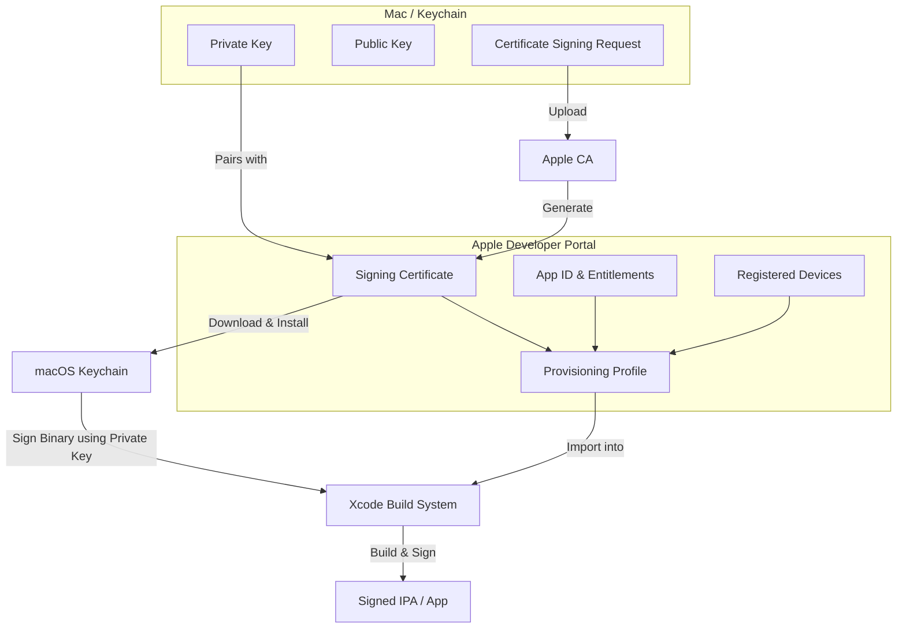

# Code Signing & Troubleshooting Deep Dive 🛡️

Code signing is Apple's security mechanism to verify the identity of the app's author and ensure that the application has not been tampered with since it was signed. For developers, code signing is often one of the most complex aspects of iOS development.

This guide clarifies how code signing components fit together and provides solutions for common signing errors.

---

## 1. How Code Signing Works

At its core, code signing associates a **Cryptographic Signature** with your application bundle. iOS devices verify this signature against Apple's Root Certificate Authority before allowing the app to run.

Here is how the components interact:



### Core Components Explained

| Component | Location | Description |
|---|---|---|
| **Private Key** | macOS Keychain | Created on your local Mac when you generate a Certificate Signing Request (CSR). It must remain secure and never leave your machine (unless exported to another developer's Mac). |
| **Certificate (`.cer`)**| Keychain & Portal | A public key signed by Apple. It binds your identity (individual or team) to a public key. There are **Development** certificates (for debugging) and **Distribution** certificates (for TestFlight/App Store). |
| **App ID & Entitlements** | Developer Portal | A two-part string identifying one or more apps (e.g., `TeamID.com.example.app`). Entitlements represent capabilities requested by the app (e.g., Push Notifications, iCloud, Associated Domains). |
| **Provisioning Profile (`.mobileprovision`)** | Developer Portal & Xcode | The "glue" that binds a **Signing Certificate**, an **App ID**, and a list of **Registered Devices** (only for Development/Ad-Hoc builds) together. |

---

## 2. Automatic vs. Manual Signing

Xcode offers two ways to manage code signing:

### Automatic Signing (Recommended)
- **How it works**: Xcode connects to your Developer Portal account, generates certificates, registers connected devices, and creates provisioning profiles automatically.
- **When to use**: Almost always, especially for standard apps, individual developers, and team environments.
- **Enable**: In Xcode, go to the target's **Signing & Capabilities** tab and check **"Automatically manage signing"**.

### Manual Signing
- **How it works**: You generate and download certificates and provisioning profiles from the Apple Developer Portal manually and select them in Xcode.
- **When to use**: Highly customized enterprise build setups, continuous integration (CI) servers where Xcode lacks developer account logins, or when using custom profile names.

---

## 3. Common Code Signing Errors & Solutions

Here are the most frequent code signing errors and how to resolve them:

### ❌ Error 1: "No signing certificate 'iOS Development' found"
> **Symptom**: Xcode complains that it cannot find a valid signing identity in your Keychain.

#### 💡 Solution:
1. **Ensure the Certificate is installed**: Open the Keychain Access app and look under "My Certificates". Verify your developer certificate is present.
2. **Ensure you have the Private Key**: The certificate must have a dropdown disclosure arrow showing a private key under it. If the private key is missing:
   - Generate a new certificate from the Apple Developer Portal using a new CSR from your Mac.
   - Or, if working in a team, ask the certificate creator to export it as a `.p12` file (with the private key) and install it on your Mac.

---

### ❌ Error 2: "Provisioning profile doesn't include signing certificate"
> **Symptom**: The selected provisioning profile does not contain the public key associated with the active certificate Xcode is trying to sign with.

#### 💡 Solution:
1. Go to the **Apple Developer Portal > Certificates, Identifiers & Profiles > Profiles**.
2. Select the problematic profile and click **Edit**.
3. Under the **Certificates** section, check the box next to the active certificate you are using.
4. Click **Save**, download the updated profile, and double-click it to install it in Xcode.
5. If using **Automatic Signing**, uncheck and re-check **"Automatically manage signing"** to force Xcode to regenerate the profile.

---

### ❌ Error 3: "Provisioning profile doesn't support the Entitlements capability"
> **Symptom**: Your app's `.entitlements` file specifies a capability (e.g., Push Notifications, Apple Sign-In) that isn't enabled on the App ID in the Developer Portal.

#### 💡 Solution:
1. Go to **Apple Developer Portal > Identifiers**.
2. Select your **App ID** (Bundle ID).
3. Scroll through the **Capabilities** list and check the box for the missing entitlement (e.g., Push Notifications).
4. Save the changes.
5. Regenerate and download the provisioning profiles that depend on this App ID. (Or uncheck/recheck Automatic Signing).

---

### ❌ Error 4: "Bundle Identifier is not available"
> **Symptom**: Xcode fails to register your Bundle ID because it is already registered by another Apple Developer account.

#### 💡 Solution:
1. Bundle IDs must be **globally unique**.
2. Modify your App's Bundle Identifier in Xcode (e.g., change `com.example.myapp` to `com.example.myapp-unique`).
3. Make sure you are logged into the correct Apple Developer Account in **Xcode > Settings > Accounts**.

---

### ❌ Error 5: "Profile has expired"
> **Symptom**: The provisioning profile has passed its expiration date (typically 1 year from creation).

#### 💡 Solution:
1. **For Automatic Signing**: Xcode will automatically renew the profile. Just clean the build (`Cmd + Shift + K`) and rebuild.
2. **For Manual Signing**: Go to the Developer Portal, find the profile, click **Edit**, then click **Save** (re-generating it). Download the new file and open it.

---

## 🛠️ Code Signing Command Line Tools

If you are debugging code signing on a CI/CD server, these command line tools are essential:

```bash
# List all signing identities in your Keychain
security find-identity -v -p codesigning

# Inspect a Provisioning Profile's contents (XML format)
security cms -D -i path/to/profile.mobileprovision

# Inspect the signature and entitlements of a built .app bundle
codesign -d --entitlements :- path/to/YourApp.app
```
